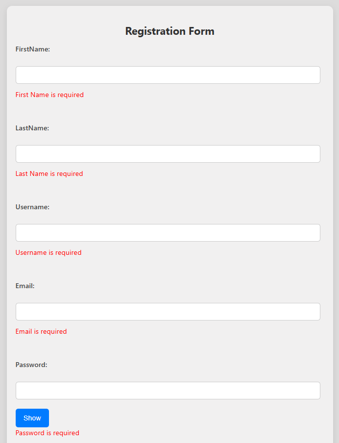
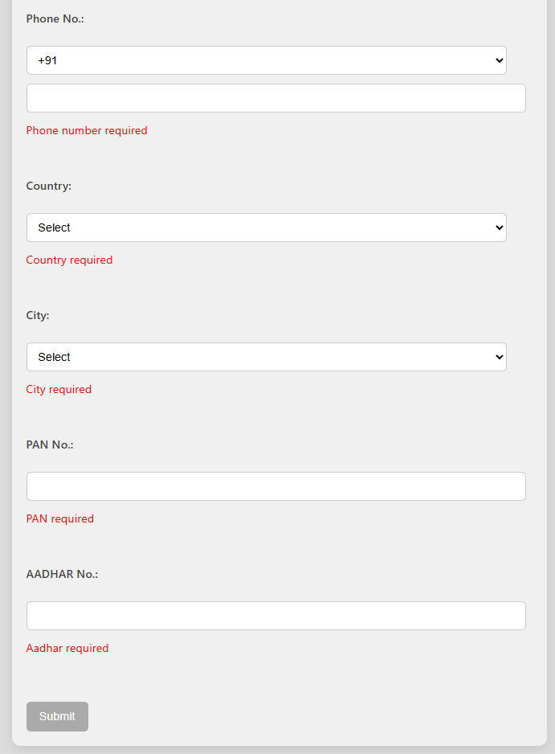
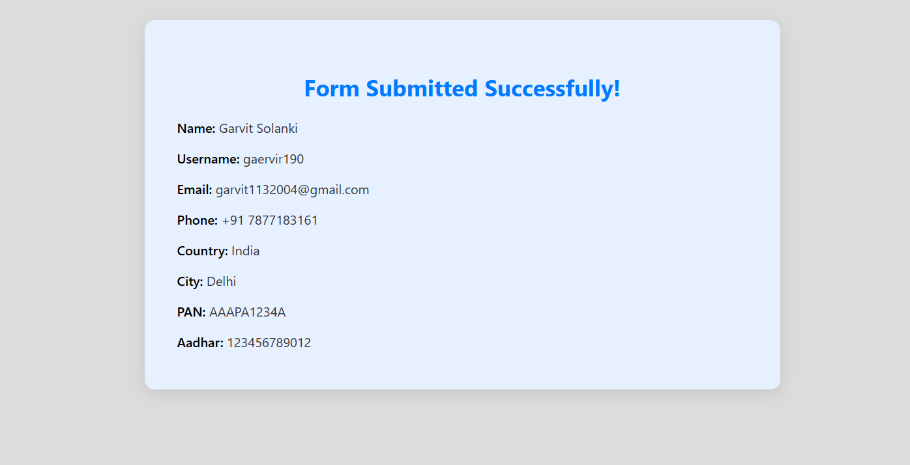

# 🚀 React Form with Validation and Routing

Welcome to this beginner-friendly React app that shows you how to build a **clean, efficient, and fully validated form** from scratch! 🎉

This app features dynamic **Country → City** dropdowns, a handy **show/hide password toggle**, and a smooth redirect to a **success page** that beautifully displays all your submitted data — all without relying on any third-party form libraries. Lightweight and easy to understand, it’s perfect for learning or building your own projects!

---

## ✨ Key Features

✅ **Real-time form validation** with clear and friendly error messages  
🔒 **Show/Hide Password Toggle** for better user experience  
🌍 **Dynamic dropdowns** — select a country, and the city options update instantly!  
🚫 **Submit button disabled** until the entire form is valid — no accidental submissions!  
🎉 **Success page redirect** showing a neat summary of your submitted information  
🎨 Clean and minimal **CSS styling** for a smooth and intuitive UI  


---

##  Validated Form Feilds
| Field         | Validation                           |
| ------------- | ------------------------------------ |
| First Name    | Required                             |
| Last Name     | Required                             |
| Username      | Required                             |
| Email         | Required & valid format              |
| Password      | Required                             |
| Phone         | Required                             |
| Country       | Required                             |
| City          | Required (based on selected country) |
| PAN Number    | Required                             |
| Aadhar Number | Required                             |


##  UserInterface Screenshot


### 📋 Form Page




### ✅ Success Page



---

## 📂 Project Structure

react-form/
├── public/
│ └── index.html
├── src/
│ ├── App.js
│ ├── index.js
│ ├── FormPage.js
│ ├── SuccessPage.js
│ └── App.css
│ ├── FormPage.css
│ └── SuccessPage.css
├── package.json
├── README.md
└── .gitignore


## ⚙️ How to Run Locally

### 📌 Prerequisites

- Node.js and npm installed on your system
- Git installed

### 🔧 Setup Steps

#### 1. Clone the Repository

```bash
git clone https://github.com/Garvit1904/Celebel_React_App_1.git
npm start

This runs the app in development mode at:
http://localhost:3000
